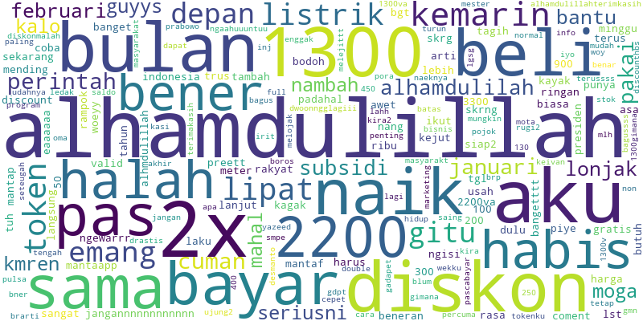
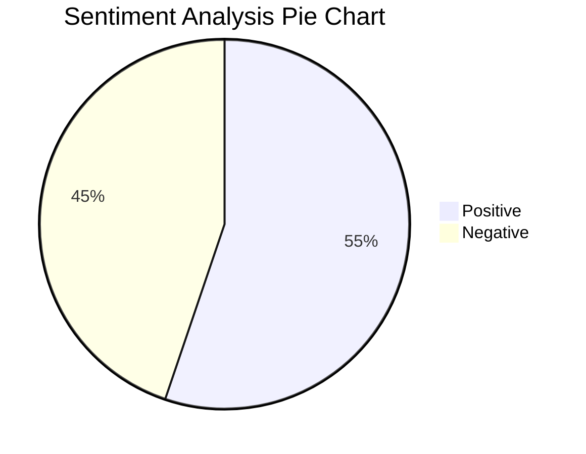
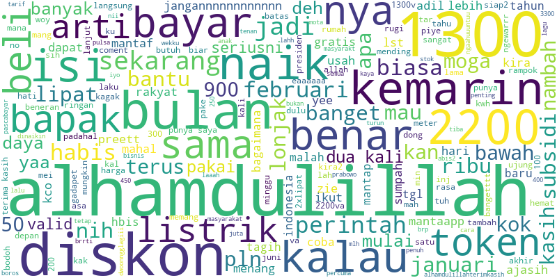
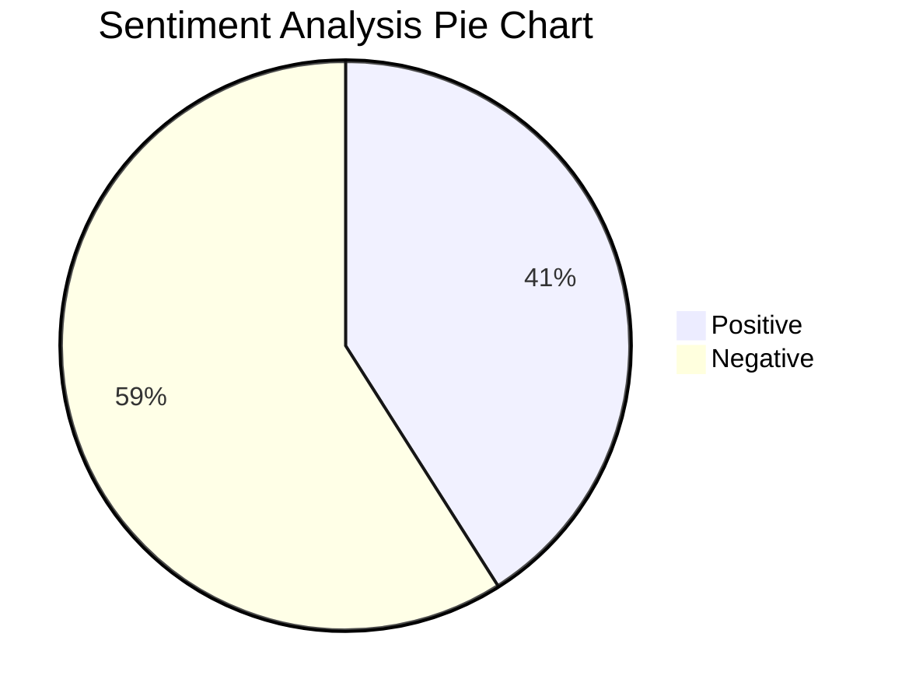
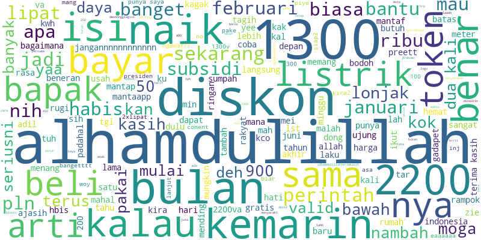

# Simple-TikTok-Post-Text-Mining

A simple case study for learning how to perform text mining on TikTok posts.  
This case study uses a TikTok post discussing the Indonesian government's 50% electricity discount for June–July 2025, offered to customers using less than 1300 VA.  

> Original post: https://vt.tiktok.com/ZSh32YKTB/ 

# Goals 🎯

1. Analyze user sentiment from TikTok posts
2. Summarize user comments

---
---

# Result 📝

- [TEST 1](#test-1)
- [TEST 2](#test-2)

## TEST 1

**Goal:** Analyze sentiment on posts from [context or subset].

<table border="1" style="width: 100%">
  <tr>
    <th>Sentiment analysis</th>
    <td>Lexicon based</td>
  </tr>
  <tr>
    <th>Accuracy</th>
    <td>-%</td>
  </tr>
  <tr>
    <th>Observation</th>
    <td>-</td>
  </tr>
</table>

### Step by step

1. Data pre processing

    - Case folding
    - Data cleaning
    - Tokenization
    - Word repair
    - Stopword removal
    - Stemming

2. Vectorization with  Term Frequency-Inverse Document Frequency (TF-IDF)
3. Sentiment analysis with lexicon-based approach

### Visualization

Word Cloud Visualization from TEST 1

## TEST 2

**Goal:** Analyze sentiment on posts from [context or subset].

<table border="1" style="width: 100%">
  <tr>
    <th>Sentiment analysis</th>
    <td>Lexicon based</td>
  </tr>
  <tr>
    <th>Accuracy</th>
    <td>-%</td>
  </tr>
  <tr>
    <th>Observation</th>
    <td>-</td>
  </tr>
</table>

### Step by step

1. Data pre processing

    - Case folding
    - Data cleaning
    - Tokenization
    - Word repair

      Changed word repair method: switched library to RapidFuzz and updated to a different custom dictionary.
    - Stopword removal
    - Stemming

2. Vectorization with  Term Frequency-Inverse Document Frequency (TF-IDF)
3. Sentiment analysis with supervised learning approach (manual labelling)

### Visualization

Word Cloud Visualization from TEST 2

## TEST 3

**Goal:** Analyze sentiment on posts from [context or subset].

<table border="1" style="width: 100%">
  <tr>
    <th>Sentiment analysis</th>
    <td>Lexicon based</td>
  </tr>
  <tr>
    <th>Accuracy</th>
    <td>-%</td>
  </tr>
  <tr>
    <th>Observation</th>
    <td>-</td>
  </tr>
</table>

### Step by step

1. Data pre processing

    - Case folding
    - Data cleaning

      Add remove repeadted characters process. Example: "jangannnnnn" -> "jangan", "semangattt" -> "semangat"
    - Tokenization
    - Word repair

      Use RapidFuzz library
    - Stopword removal
    - Stemming

2. Vectorization with  Term Frequency-Inverse Document Frequency (TF-IDF)
3. Sentiment analysis with supervised learning approach (manual labelling)

### Visualization

Word Cloud Visualization from TEST 3

